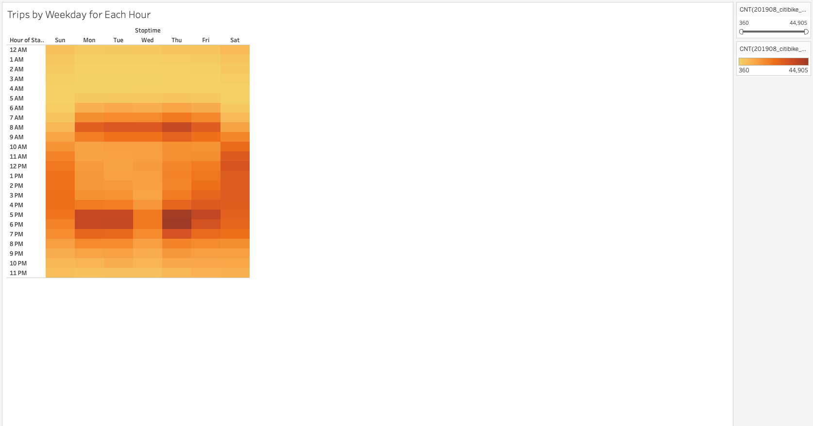
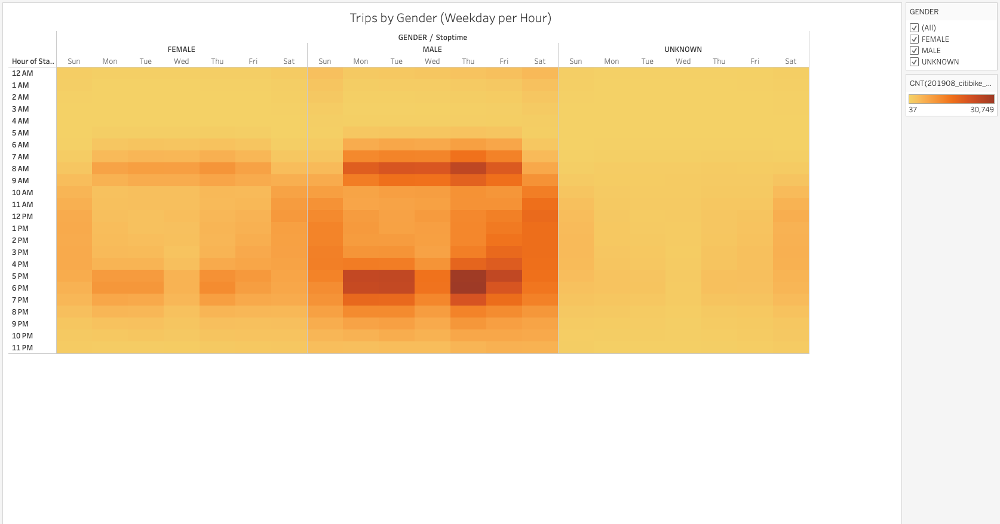
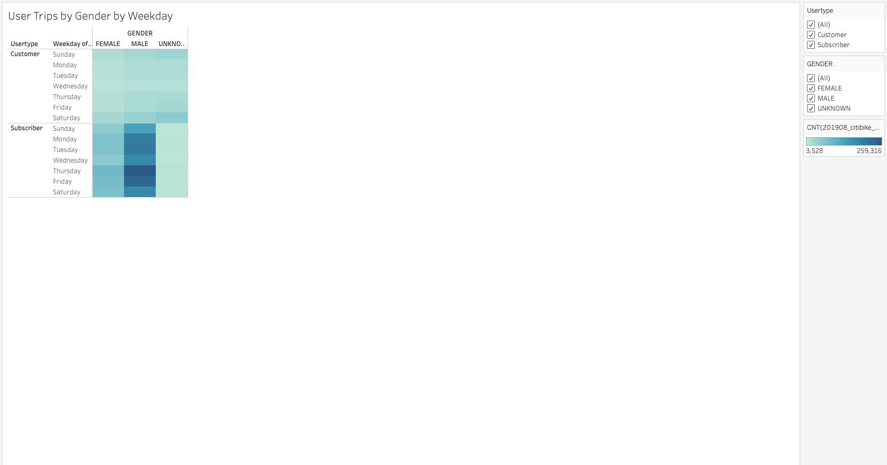
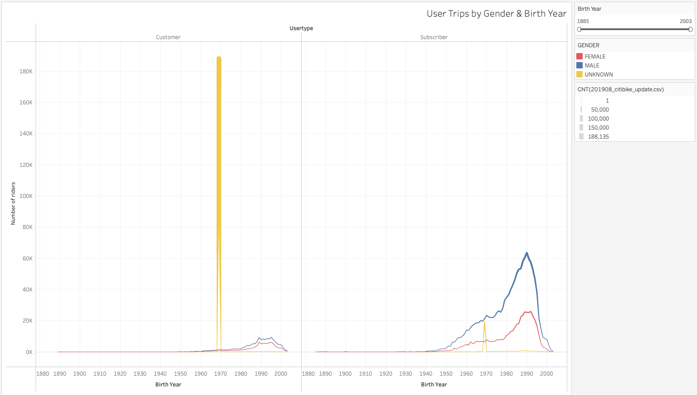
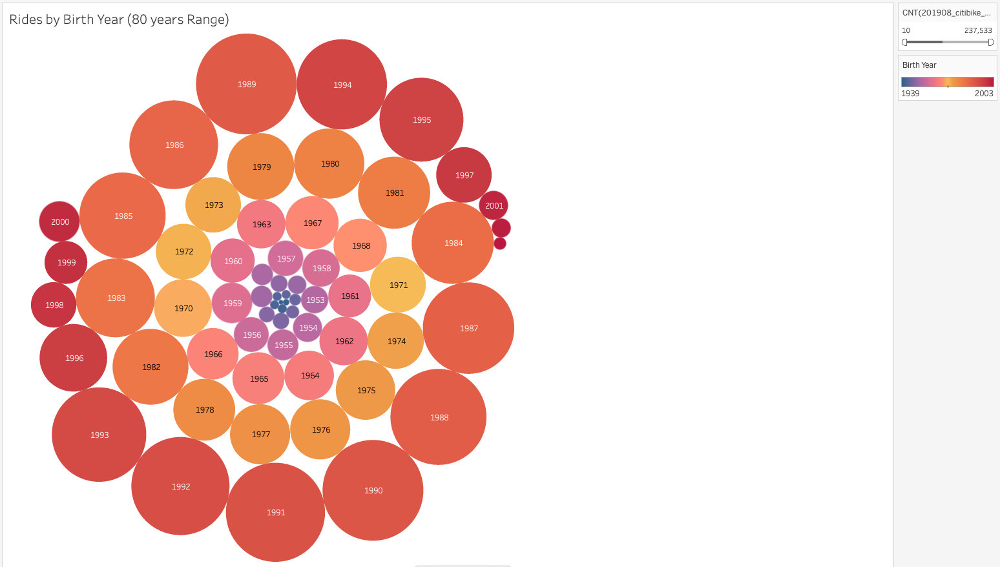

# CityBike NYC Bikesharing 

## Project Overview 
 
With data from City Bike [201908-citibike-tripdata.csv.zip](https://s3.amazonaws.com/tripdata/201908-citibike-tripdata.csv.zip), I was able to work on raw date from .csv file, clear and organize the date on Jupyter Notebook [NYC_CityBike](/Users/marciociano/Documents/GitHub/bikesharing/NYC_CitiBike_Challenge.ipynb) and then load the dataset on Tableau Public to creat somo visualizations in order to provide some answers to the questions.

## Link to Tableau Story
[link to dashboard](https://public.tableau.com/app/profile/marcio.roberto.ciano/viz/NYCCitibikeSharing_16441190729910/NYCBikeSharing?publish=yes)

## Results

* *Checkout Times for Users*

With this Line graph we can see the quantity of bikes are checkout, correlating to the duration of the trip, barely used for more than 60 minutes, and very frequent betweeen 5 to 30 minutes.

* *Checkout Times for Users*

This line graph presents quiet simillar information for above chart, but this bings the data separte by gender, and can expose that the main public are male with average longer usage then female. 
* *Trips by Weekday for Each Hour*

Heatmap can provide the busiest hours and busiest days. The peak time are for weekedays 7am to 8am and 5pm to 6pm relatively for work and school times. on the weekend the rides are more frequent on Saturaday between 9am untill 6pm and followed by Sundays with slitly less usage. 
* *Trips by Gender (Weekday per Hour)*

Continuing on Heatmap, but using the gender information the peak usage are quiet similar behavior, but highlight the male usage as we see on Line Chart *Checkout Times for Users* .
Unknown visualization does not provide much information as it has low data volume.

* *User Trips by Gender by Weekday*

Another heatmap chart to ilustrate the quantity of users (male/female/unknown) are subricribers or customer that is not subscribed.
This chart shows that unknown gender is very low, which make the assumption that subcribers provides better data quality, and customer information can be not accurate, as the use as they go.

* *User Trips by Gender & Birth Year*

This line charte helps to rehinforce that customer data are no accurate and should not be considered to this analysis, as the chart shows Unknown (yellow) has a peak of riders and this peak revels the bith year *1969* is over 188k riders, understanding what is Customers according to Citibike "User Type (Customer = 24-hour pass or 3-day pass user; Subscriber = Annual Member)" [Retrived_from: Site Link](https://ride.citibikenyc.com/system-data).
Customers can be sign up or just insert a card to release the bike, the bikesharing terminal is not fully capable to collect just data. 

* *Rides_by_Year*

This buble chart has a age range of 80 years (1939-2019) excluiding 1969 as it has the not reliable inforation as encontered chart above. The idea to reduce the Age range is because was encountered some user with over 100 years and seems to be quite no accurate.
With that being said, this bubble chart reveals the most riders is born between 1984-1995.

## Summary 

This analysis helps to understand the profile of users of Citibike, as the main users are between 40-30's years old, the company has potencial market to gain the generation of 20-30's using social media. These platforms can concetrate they data traffic to hook up more users or Subscribers.

In the other hand, the data can help to provide best maintenance times for the bikes, avoiding the peak time and not disturb users. Also could help where the is the busiest spots to strat a ride and provide extra bikes to avoid shortage and maximize the confiability for users.

